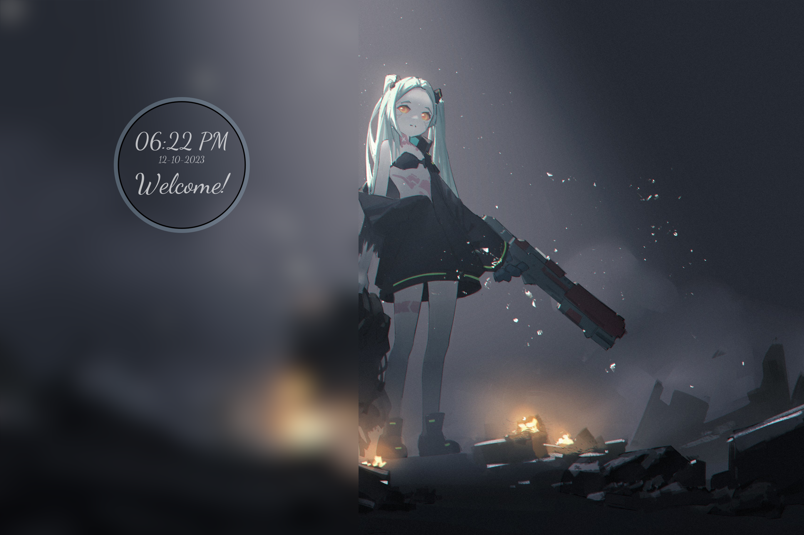

<div align="center">
  <h1> 44Bars </h1>
</div>
<div align="center">


</div>

## Nix
```
home/
    pk/
        config/
        home.nix
        ...
    shared/
        ...
hosts/
    44Bars/
        hardware-configuration.nix
        configuration.nix
    ...
```
This is the general structure of my dotfiles.

1. hosts/
- contains machine specific configurations
- `44Bars` contains the configurations for my current laptop
- `old44Bars` contains the configurations for my old (dead) surfcae

2. home/
- contains home-manager(user specific) configurations
- `shared` contains wallpapers, color schemes, scripts etc.

## Screenshots
| <b>Launch Menu</b>                                                                              |
| ------------------------------------------------------------------------------------------------------------------ |
| <a href="#--------"></a>                    |

<b>Lock Screen</b>             |  <b>Login Screen</b>  
:-------------------------:|:-------------------------:
<a href="#--------"></a>  |  <a href="#--------"></a>

## Installation
Don't

just ... just don't

## To-DO

- [ ] wofi menu with run mode
- [ ] fancy waybar
- [ ] wallpaper changer
- [ ] basic apps (discord, mattermost etc)
- [ ] wl_clipboard

## Credits old44Bars
> **Note**
>
> I do apologies for missing credits as I started documenting after I already had a basic setup.

- [chadcat](https://github.com/chadcat7)
    - style of readme
    - folder structure
- [Teenarp](https://github.com/Teenarp2003)
    - polybar
- [Ronnie Nissan](https://github.com/ronniedroid)
    - Wall-d
- [Michael Peyton Jones](https://github.com/michaelpj)
    - sddm theme nix package
- [David Worms](https://www.adaltas.com/en/2022/03/29/nix-package-creation-install-font/)
    - font packaging